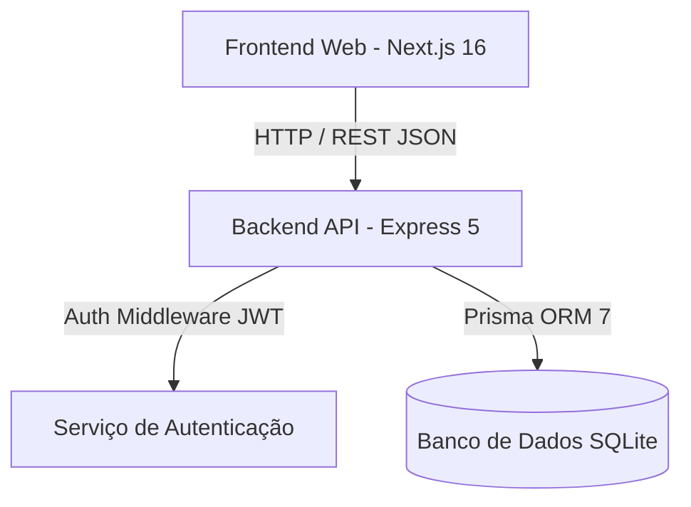
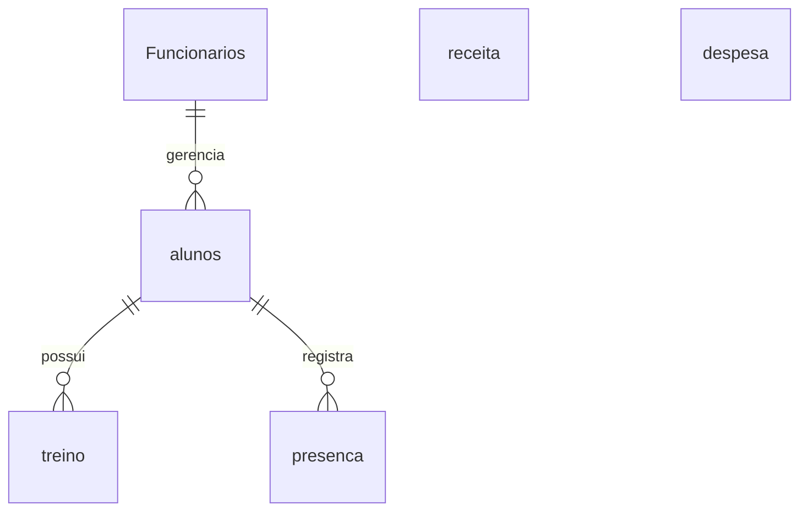
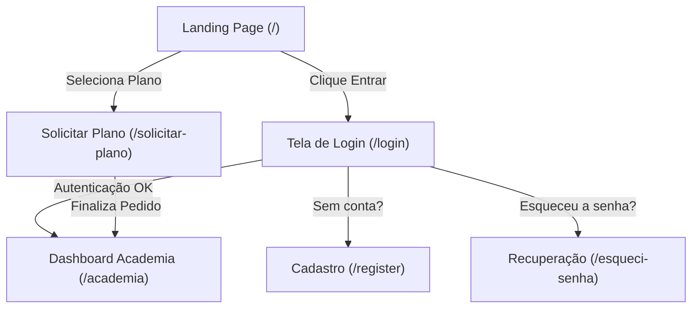

# 🏋️‍♂️ GymFlow — Sistema Integrado de Gestão para Academias

> **Trabalho de Conclusão de Curso (TCC) — Desenvolvimento de Sistemas**  
> **Repositório Backend:** [https://github.com/kauan-math/TCC-back-end](https://github.com/kauan-math/TCC-back-end)  
> **Repositório Frontend:** [https://github.com/kauan-math/FrontEnd](https://github.com/kauan-math/FrontEnd)

---

# 1. Documentação Geral do Projeto

## Introdução

### Nome do Projeto

**GymFlow** — Plataforma Web & API REST para Gestão Completa de Academias, Estúdios e Centros Esportivos.

### Problema que Resolve

A gestão de academias frequentemente enfrenta desafios operacionais como:

- Descontrole no cadastro e vencimento de mensalidades dos alunos;
- Dificuldade no acompanhamento e atualização das fichas de treino;
- Falta de visibilidade sobre presenças e acessos diários;
- Gestão descentralizada de funcionários, cargos, turnos e dados de contratados;
- Falta de controle financeiro unificado (saídas/despesas operacionais como água, luz e internet vs. entradas/receitas de mensalidades).

O **GymFlow** resolve esses problemas unificando todas as operações administrativas, financeiras e pedagógicas (treinos) em uma única plataforma digital.

### Objetivo

Desenvolver uma solução tecnológica completa e escalável composta por um **Backend (API REST)** robusto e um **Frontend Web** moderno e intuitivo, permitindo:

1. Gestão completa de cadastros (alunos, treinos, funcionários, receitas e despesas);
2. Autenticação e controle de acesso baseado em perfis (Administrador, Funcionário, Aluno);
3. Fluxo completo de contratação/solicitação de planos com checkout interativo;
4. Monitoramento financeiro com gráficos e indicadores em tempo real.

### Público-alvo

- **Proprietários e Gestores de Academias**: Para visão estratégica e financeira;
- **Recepcionistas e Administradores**: Para atendimento, cadastros e controle de acessos;
- **Personal Trainers e Instrutores**: Para elaboração e acompanhamento de treinos;
- **Alunos**: Para consulta de planos, treinos e histórico.

---

## Tecnologias Utilizadas

### Backend API

- **Ambiente de Execução**: [Node.js](https://nodejs.org/)
- **Linguagem**: TypeScript (TSX executor)
- **Framework Web**: [Express 5](https://expressjs.com/)
- **ORM & Banco de Dados**: [Prisma ORM 7](https://www.prisma.io/) + `@prisma/adapter-better-sqlite3`
- **Autenticação & Segurança**: JSON Web Tokens (`jsonwebtoken`), `bcrypt` (hash de senhas)
- **Documentação & Utilitários**: `swagger-ui-express`, `dotenv`, `cors`

### Frontend Web

- **Core**: HTML5, TypeScript, JavaScript (ESNext)
- **Framework**: [Next.js 16](https://nextjs.org/) (App Router, Turbopack)
- **Biblioteca de Interface**: [React 19](https://react.dev/)
- **Estilização**: Tailwind CSS v4, Lucide React (Ícones)
- **Integração de APIs**: Axios
- **Visualização de Dados**: Recharts
- **Mapas**: Leaflet / React-Leaflet

### Banco de Dados

- **SGBD**: SQLite 3 (armazenamento leve e ágil via file-system com suporte relacional via Prisma ORM)

### Ferramentas & Versionamento

- **Versionamento**: Git & GitHub
- **Gerenciador de Pacotes**: `npm`
- **Ambiente Dev**: Visual Studio Code / Antigravity Agentic IDE

---

## Arquitetura do Sistema

O sistema adota a arquitetura **Cliente-Servidor (API RESTful)** desacoplada.

### Fluxo de Dados e Comunicação



1. **Requisição do Usuário**: O usuário interage com a interface Next.js.
2. **Envio via Axios**: As ações (login, cadastro, inserção de treino, registro de despesa) disparam requisições HTTP REST em formato JSON.
3. **Validação e Autenticação**: O backend Express intercepta as requisições protegidas pelo middleware `authentication`, validando o cabeçalho `Authorization: Bearer <token>`.
4. **Persistência**: As regras de negócio executam as operações no banco SQLite por meio das queries estruturadas pelo Prisma ORM.
5. **Resposta**: O backend retorna a resposta HTTP padronizada (`200 OK`, `201 Created`, `400 Bad Request`, `401 Unauthorized`, `500 Internal Error`).

### Estrutura do Projeto

```
GymFlow/
├── TCC-back-end/                 # Repositório Backend
│   ├── prisma/
│   │   └── schema.prisma         # Modelagem do Banco de Dados Prisma
│   ├── src/
│   │   ├── controllers/          # Controladores de Regra de Negócio
│   │   ├── middlewares/          # Autenticação JWT
│   │   ├── app.ts                # Configuração do Express & Middlewares
│   │   ├── routes.ts             # Definição de Rotas REST
│   │   └── index.ts              # Ponto de Entrada / Inicialização do Servidor
│   ├── package.json
│   └── tsconfig.json
│
└── FrontEnd/                     # Repositório Frontend Web
    ├── app/                      # Rotas e Páginas do Next.js (App Router)
    │   ├── page.tsx              # Landing Page Principal
    │   ├── login/                # Tela de Login Unificada
    │   ├── register/             # Tela de Cadastro
    │   ├── esqueci-senha/        # Recuperação de Senha
    │   ├── solicitar-plano/      # Checkout de Planos (3 Etapas)
    │   └── academia/             # Dashboard Administrativo
    ├── components/               # Componentes de UI e Layout
    ├── src/services/             # Cliente de Integração HTTP (Axios)
    ├── package.json
    └── tsconfig.json
```

---

## Como Executar o Projeto

### Pré-requisitos

- **Node.js** v18.0.0 ou superior instalado;
- **npm** (incluso com o Node.js);
- **Git** instalado.

---

### Executando o Backend (`TCC-back-end`)

1. **Clonar o repositório:**

   ```bash
   git clone https://github.com/kauan-math/TCC-back-end.git
   cd TCC-back-end
   ```

2. **Instalar dependências:**

   ```bash
   npm install
   ```

3. **Configurar variáveis de ambiente (`.env`):**
   Crie um arquivo `.env` na raiz do projeto backend com o seguinte conteúdo:

   ```env
   PORT=3000
   DATABASE_URL="file:./dev.db"
   JWT_SECRET="gymflow_secret_key_tcc_2026"
   ```

4. **Gerar Prisma Client e Migrações de Banco:**

   ```bash
   npx prisma db push
   ```

5. **(Opcional) Popular o banco com dados iniciais (Seed):**

   ```bash
   npm run seed
   ```

6. **Iniciar o Servidor em Modo Desenvolvimento:**
   ```bash
   npm run dev
   ```
   _O backend estará rodando em:_ `http://localhost:3000`

---

### Executando o Frontend (`FrontEnd`)

1. **Clonar o repositório:**

   ```bash
   git clone https://github.com/kauan-math/FrontEnd.git
   cd FrontEnd
   ```

2. **Instalar dependências:**

   ```bash
   npm install
   ```

3. **Configurar variável da API (`.env.local`):**
   Crie um arquivo `.env.local` na raiz do projeto frontend:

   ```env
   NEXT_PUBLIC_API_URL=http://localhost:3000
   ```

4. **Iniciar a aplicação Next.js:**
   ```bash
   npm run dev
   ```
   _Acesse o frontend no navegador em:_ `http://localhost:3000` (ou `http://localhost:3001` caso a porta 3000 esteja em uso pelo backend).

---

# 2. Documentação do Backend

## Arquitetura

O backend utiliza a arquitetura MVC/Controller-Service padronizada em Node.js com Express:

- **Routes (`src/routes.ts`)**: Mapeamento centralizado de rotas HTTP para seus respetivos controllers;
- **Middlewares (`src/middlewares/`)**: Verificação de token JWT de autenticação (`authentication.ts`);
- **Controllers (`src/controllers/`)**: Manipulação de dados de requisição, regras de validação e comunicação com o banco;
- **Database / Prisma (`prisma/schema.prisma`)**: Camada de persistência ORM fortemente tipada.

## Tabela de Rotas da API REST

| Método   | Rota                 | Autenticado | Descrição                                                       |
| :------- | :------------------- | :---------: | :-------------------------------------------------------------- |
| `GET`    | `/`                  |     Não     | Retorna o status e versão da API                                |
| `POST`   | `/login`             |     Não     | Autentica um usuário (Aluno ou Funcionário) e retorna Token JWT |
| `POST`   | `/solicitar-plano`   |     Não     | Cadastra pedido público de assinatura de plano e gera cobrança  |
| `GET`    | `/alunos`            |   **Sim**   | Lista todos os alunos cadastrados                               |
| `POST`   | `/alunos`            |   **Sim**   | Cadastra um novo aluno                                          |
| `GET`    | `/alunos/:id`        |   **Sim**   | Busca dados detalhados de um aluno específico                   |
| `PUT`    | `/alunos/:id`        |   **Sim**   | Atualiza os dados de um aluno                                   |
| `DELETE` | `/alunos/:id`        |   **Sim**   | Remove um aluno do sistema                                      |
| `GET`    | `/treinos`           |   **Sim**   | Lista todas as fichas de treino                                 |
| `POST`   | `/treinos`           |   **Sim**   | Cria uma nova ficha de treino vinculada a um aluno              |
| `GET`    | `/treinos/:id`       |   **Sim**   | Detalhes de um treino                                           |
| `PUT`    | `/treinos/:id`       |   **Sim**   | Atualiza uma ficha de treino                                    |
| `DELETE` | `/treinos/:id`       |   **Sim**   | Remove uma ficha de treino                                      |
| `GET`    | `/funcionarios`      |   **Sim**   | Lista a equipe de funcionários da academia                      |
| `POST`   | `/funcionarios`      |   **Sim**   | Cadastra um novo funcionário                                    |
| `GET`    | `/funcionarios/:id`  |   **Sim**   | Busca dados de um funcionário                                   |
| `PUT`    | `/funcionarios/:id`  |   **Sim**   | Atualiza um funcionário                                         |
| `DELETE` | `/funcionarios/:id`  |   **Sim**   | Deleta um funcionário                                           |
| `GET`    | `/receitas`          |   **Sim**   | Lista receitas/pagamentos recebidos                             |
| `POST`   | `/receitas`          |   **Sim**   | Registra uma nova receita                                       |
| `GET`    | `/receitas/:id`      |   **Sim**   | Busca uma receita pelo ID                                       |
| `PUT`    | `/receitas/:id`      |   **Sim**   | Atualiza dados de uma receita                                   |
| `DELETE` | `/receitas/:id`      |   **Sim**   | Remove o registro de uma receita                                |
| `GET`    | `/despesas`          |   **Sim**   | Lista as despesas operacionais registradas                      |
| `GET`    | `/despesas/summary`  |   **Sim**   | Resumo e totais financeiros das despesas por categoria          |
| `POST`   | `/despesas`          |   **Sim**   | Cadastra uma nova despesa (Luz, Água, Internet, etc.)           |
| `PUT`    | `/despesas/:id`      |   **Sim**   | Atualiza uma despesa existente                                  |
| `DELETE` | `/despesas/:id`      |   **Sim**   | Remove uma despesa                                              |
| `POST`   | `/presencas`         |   **Sim**   | Registra entrada/acesso de um aluno                             |
| `GET`    | `/presencas/hoje`    |   **Sim**   | Lista os acessos registrados no dia corrente                    |
| `POST`   | `/matricular/:id`    |   **Sim**   | Realiza a matrícula do aluno                                    |
| `DELETE` | `/desmatricular/:id` |   **Sim**   | Cancela a matrícula do aluno                                    |

### Exemplo de Requisição — `POST /login`

- **Body JSON:**
  ```json
  {
    "email": "admin@gymflow.com",
    "senha": "123456"
  }
  ```
- **Resposta Sucesso (`200 OK`):**
  ```json
  {
    "success": true,
    "token": "eyJhbGciOiJIUzI1NiIsInR5cCI6IkpXVCJ9...",
    "user": {
      "id": 1,
      "nome": "Carlos Silva",
      "email": "admin@gymflow.com",
      "cargo": "Gerente",
      "adm": true
    }
  }
  ```

---

## Autenticação e Segurança

- **JSON Web Token (JWT)**: Utilizado para controle de sessão stateless.
- **Header**: Enviar `Authorization: Bearer <TOKEN>` nas rotas protegidas.
- **Criptografia de Senha**: Senhas armazenadas com hash `bcrypt` com salt rounds para prevenir vazamentos.
- **Controle de Acesso (RBAC)**: O campo `adm` no modelo `Funcionarios` diferencia administradores de usuários padrão.

---

# 3. Banco de Dados

## Modelagem Relacional

O banco de dados relacional (SQLite via Prisma ORM) é estruturado da seguinte forma:



## Estrutura das Tabelas

### 1. `alunos`

Guarda as informações dos alunos matriculados.

- `id` (Int, PK, Autoincrement)
- `nome` (String)
- `email` (String)
- `cpf` (String)
- `senha` (String, Opcional)
- `plano` (String)
- `idade` (Int, Opcional)
- `dataNascimento` (DateTime, Opcional)
- `ultimoAcesso` (DateTime, Opcional)
- `funcionarioId` (Int, FK -> `Funcionarios.id`, Opcional)
- `createdAt` / `updatedAt` (DateTime)

### 2. `Funcionarios`

Guarda os dados dos funcionários e administradores da academia.

- `id` (Int, PK, Autoincrement)
- `nome` (String)
- `adm` (Boolean, Default: false)
- `email` (String)
- `senha` (String)
- `cpf` (String)
- `clt` (String)
- `turno` (String)
- `cargo` (String)
- `idade` / `dataNascimento` (Opcional)
- `createdAt` / `updatedAt` (DateTime)

### 3. `treino`

Representa as fichas de exercícios dos alunos.

- `id` (Int, PK, Autoincrement)
- `nome` (String)
- `descricao` (String)
- `dificuldade` (String)
- `duracao` (Int - em minutos)
- `tipoTreino` (String)
- `alunoId` (Int, FK -> `alunos.id`)
- `createdAt` / `updatedAt` (DateTime)

### 4. `receita`

Mapeia os fluxos de caixa de entrada (mensalidades e planos pagos).

- `id` (Int, PK, Autoincrement)
- `pagamento` (String)
- `dataPagamento` (DateTime)
- `valorPagamento` (String)
- `status` (String - ex: "Pago", "Pendente")
- `formaPagamento` (String - ex: "Pix", "Cartão", "Boleto")

### 5. `despesa`

Mapeia os custos operacionais da academia (contas de consumo e manutenção).

- `id` (Int, PK, Autoincrement)
- `descricao` (String)
- `valor` (Float)
- `categoria` (String - LUZ, AGUA, INTERNET, MANUTENCAO, OUTROS)
- `dataVencimento` (DateTime)
- `dataPagamento` (DateTime, Opcional)
- `status` (String - PAGO, PENDENTE)

### 6. `presenca`

Registra os acessos diários dos alunos na catraca/sistema.

- `id` (Int, PK, Autoincrement)
- `alunoId` (Int, FK -> `alunos.id`)
- `dataHora` (DateTime, Default: now())

---

# 4. Documentação do Frontend Web

## Telas do Sistema

### 1. Landing Page (`/`)

- **Objetivo**: Apresentação comercial do ecossistema GymFlow.
- **Funcionalidades**: Hero banner com chamada de ação, lista de benefícios da plataforma, seção explicativa "Como Funciona", tabela comparativa de planos (Starter, Professional, Enterprise) e botão de redirecionamento para checkout.

### 2. Tela de Login (`/login`)

- **Objetivo**: Autenticação unificada de administradores, funcionários e alunos.
- **Funcionalidades**: Validação de e-mail e senha, integração com API `/login`, armazenamento do Token JWT no navegador e redirecionamento para o Dashboard (`/academia`).

### 3. Tela de Cadastro (`/register`)

- **Objetivo**: Permite o registro direto de novos usuários no sistema.
- **Funcionalidades**: Validação de campos obrigatórios (nome, e-mail, senha, CPF, telefone) e integração com a rota de alunos/usuários.

### 4. Recuperação de Senha (`/esqueci-senha`)

- **Objetivo**: Instruções e envio de redefinição de acesso.
- **Funcionalidades**: Validação de e-mail e fluxo guiado para recuperação de conta.

### 5. Checkout / Solicitação de Planos (`/solicitar-plano`)

- **Objetivo**: Processo de compra de assinaturas corporativas ou individuais.
- **Funcionalidades**:
  - **Etapa 1**: Escolha da frequência (Mensal ou Anual com 20% de desconto), seleção do plano e preenchimento dos dados da academia (Nome, Responsável, E-mail, CPF/CNPJ, Telefone).
  - **Etapa 2**: Escolha do método de pagamento (Cartão de Crédito com preview 3D, Pix com geração de QR Code e timer de 15 min, ou Boleto Bancário com código digitável).
  - **Etapa 3**: Tela de confirmação com exibição do recibo do pedido e botão de acesso direto ao painel.
  - **Botão Voltar**: Botão customizado no topo para retornar à Landing Page a qualquer momento.

### 6. Dashboard de Gestão (`/academia`)

- **Objetivo**: Painel administrativo principal da academia.
- **Funcionalidades**:
  - **Módulo Alunos**: Lista, cadastro, edição e exclusão de alunos ativos;
  - **Módulo Treinos**: Criação e acompanhamento de treinos específicos por aluno;
  - **Módulo Funcionários**: Controle da equipe, atribuição de cargos, turnos e permissões;
  - **Módulo Financeiro**: Visão geral de receitas, lançamento e controle de despesas por categoria (Água, Luz, Internet, Manutenção) e resumo analítico;
  - **Módulo Presenças**: Registro de entradas e relatório de acessos no dia.

---

## Navegação e Fluxo do Usuário



---

# 5. Outras Categorias do Projeto

## Aplicativo Mobile / IoT

Atualmente o escopo do projeto GymFlow abrange **Backend API RESTful (Categoria 1)**, **Frontend Web Next.js (Categoria 2.A)** e **Banco de Dados Relacional Prisma/SQLite (Categoria 2.D)**, atendendo integralmente o requisito de pelo menos 2 categorias adicionais obrigatórias da proposta de TCC.

_Nota de Expansão Futura_: A estrutura do backend já foi desenvolvida com rotas REST e autenticação JWT prontas para integração de um Aplicativo Mobile (React Native / Flutter) ou dispositivos IoT (leitores de RFID/catracas integrados via rotas de `/presencas`).

---

# Entregáveis do Projeto

- [x] Código-fonte completo do Backend (`TCC-back-end`);
- [x] Código-fonte completo do Frontend Web (`FrontEnd`);
- [x] Documentação técnica completa (`README.md`);
- [x] Estrutura e scripts de banco de dados (`schema.prisma` e `seed.ts`);
- [x] Testes e builds validados em ambiente de desenvolvimento.

---

# Critérios de Avaliação Atendidos

- **Desenvolvimento Técnico**: Arquitetura desacoplada em Node.js/TypeScript e Next.js 16, uso de ORM relacional Prisma, segurança via JWT/Bcrypt e interface reativa com Tailwind CSS.
- **Organização**: Separação clara de responsabilidades no backend (routes, controllers, middlewares) e componentes modulares no frontend.
- **Documentação**: README detalhado abrangendo arquitetura, rotas, modelos de dados, instrução de execução e diagramas visuais.
